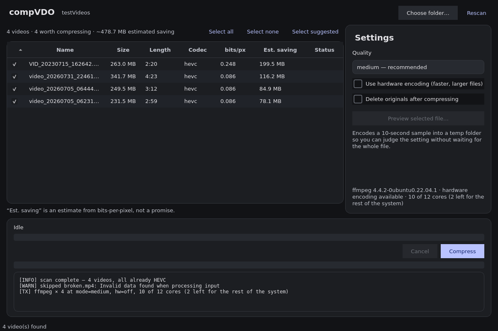
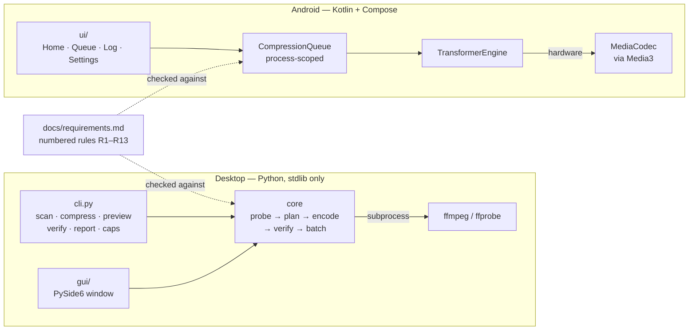
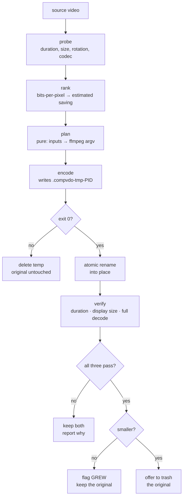
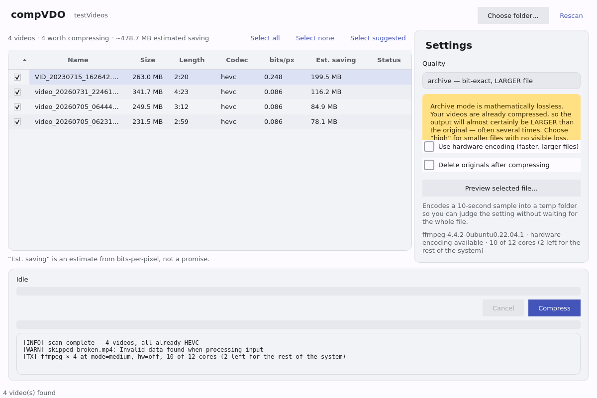

<h1 align="center">compVDO</h1>

<p align="center">
  Shrink the videos on your phone, on your own machine.<br>
  <strong>No cloud · no account · no cost · no telemetry.</strong>
</p>

<p align="center">
  
</p>

---

## Read this first: “lossless” does not mean what you want it to mean

Your phone already compressed these videos — H.264 or HEVC, straight out of the
camera encoder. Re-encoding one **mathematically losslessly** does not shrink
it. It *inflates* it, because a lossless codec has to reproduce the existing
compression artifacts bit for bit.

Measured on this project's own test clip:

| Mode | Result |
|---|---|
| `archive` — true lossless (FFV1) | 5.0 MB → **10.2 MB** · bit-exact, and twice the size |
| `high` — visually lossless (HEVC CRF 20) | 5.0 MB → 2.4 MB |
| `medium` — default (HEVC CRF 24) | 5.0 MB → 2.0 MB |

So the default is **visually lossless**: a modern codec at high quality, giving
real savings with nothing you can see. True lossless is still there as
`--mode archive`, for archival masters, and it warns you before it runs.

## It works

Four real phone clips, `--mode medium`, software x265:

| Clip | Before | After | Ratio | Time |
|---|---|---|---|---|
| `VID_20230715_162642.mp4` | 263.0 MB | 94.4 MB | **36 %** | 4:45 |
| `video_20260731_224613.mp4` | 341.7 MB | 80.4 MB | **24 %** | 11:10 |
| `video_20260705_064442.mp4` | 249.5 MB | 159.3 MB | **64 %** | 10:28 |
| `video_20260705_062317.mp4` | 231.5 MB | 153.0 MB | **66 %** | 9:39 |

**1.06 GB → 487 MB — 598.5 MB saved (55 %)**, every output verified, every
original untouched.

> **How much will *your* files save? Less predictably than you would like.**
> Three of those clips were recorded at an *identical* 0.086 bits per pixel and
> came out at 66 %, 64 % and 24 %. Bits-per-pixel arithmetic cannot see how busy
> the picture is, so [`scan`](#use-it--command-line) gives you a **ranking**, not
> a promise. `compvdo preview <file>` encodes a ten-second sample in under a
> minute and tells you the real number — it predicted 39 % where the encode
> landed at 36 %.

Also worth knowing: **modern phones record HEVC, not H.264.** Every clip above
was already HEVC. The “70 % smaller” figures you read elsewhere assume an H.264
source and do not apply.

---

## How it fits together



The two platforms **share no code**. `requirements.md` is the contract both are
checked against — see [why Android is Kotlin, not Flutter](docs/architecture.md).

### What happens to one file



Every branch that keeps a file is deliberate. See
[`docs/requirements.md`](docs/requirements.md) rules **R2** (never lose an
original), **R7.2** (a bigger output is reported, not hidden) and **R8**
(verification gates any delete).

---

## Install

```bash
sudo apt install ffmpeg          # the only hard requirement (dnf/pacman also fine)
git clone <this repo> && cd compVDO
pip install -e .                 # the CLI core is stdlib-only
pip install -e ".[gui]"          # add the desktop app
```

Check what your machine can do:

```console
$ compvdo caps
ffmpeg  /usr/bin/ffmpeg  (version 4.4.2)
encoders: ffv1, hevc_nvenc, hevc_qsv, hevc_vaapi, libaom-av1, libx264, libx265
vaapi device: /dev/dri/renderD128
cpu budget  : 10 of 12 cores (2 left for the rest of the system)
```

## Use it — command line

```bash
# What is worth compressing, and roughly what you would save
compvdo scan ~/Videos
compvdo scan ~/Videos --sort size        # or date, name, savings

# Try the settings on a 10-second sample before a long encode
compvdo preview holiday.mp4 --mode high

# Compress one file, or a whole folder
compvdo compress holiday.mp4
compvdo compress ~/Videos --mode high --preset fast
compvdo compress ~/Videos --hw auto      # ~6x faster, see Speed below

# Compress and remove the originals — only after verification passes
compvdo compress ~/Videos --delete-original

# Everything ffprobe knows, plus a verdict per file, as one markdown document
compvdo report ~/Videos -o report.md
compvdo report ~/Videos --compare ~/Videos/output -o report.md
```

Output always lands **beside the original**, named `<name>_compressed.<ext>`.

## Use it — desktop

```bash
compvdo-gui          # or: python3 -m compvdo.gui.app
```

<p align="center">
  
</p>

Pick a folder, sort by what you care about, tick what you want, press Compress.
Light/dark follows your system by default and can be pinned in **Appearance**.
The window never blocks, and Cancel actually stops ffmpeg — measured at 0.32 s.

## Use it — Android

```bash
make build           # bumps the patch version, builds a debug APK into ./build/
```

Four tabs: **Home** (album grid of your folders), **Queue**, **Log**,
**Settings**. Compression runs in the background — browse, switch tabs and
queue more while it works. A batch you add mid-run is appended, not refused.

## Quality modes

| Mode | Typical saving | Use it for |
|---|---|---|
| `low` | 75–85 % | messaging, quick sharing |
| **`medium`** *(default)* | 55–70 % | general library cleanup |
| `high` | 40–55 % | keepers you do not want to think about again |
| `archive` | **grows the file** | bit-exact masters (desktop only) |

`--crf N` overrides the ladder. Audio is **copied untouched** unless you ask
otherwise; the ladder is `keep` / `192k` / `160k` / `128k` and never goes below
128 kbps.

## Speed

Measured on a 20 s cut of real 1080p60 HEVC footage, `--mode medium`:

| invocation | time | output | vs source |
|---|---|---|---|
| default (`preset medium`) | 69.3 s | 14 MB | 56 % |
| `--preset fast` | **44.4 s** | 13 MB | 53 % |
| `--hw auto` (VAAPI) | **11.9 s** | 12 MB | 49 % |

`fast` is not a trade-off on this content — quicker *and* slightly smaller.
`--hw auto` is the big win where hardware exists; judge its output by eye, as a
fixed-function encoder's size figure alone does not prove it looks as good.

By default compVDO leaves **two cores free** so the machine stays usable.
`--cores N` to pin it.

## Safety

Enforced, not aspirational. Each maps to a numbered rule in
[`docs/requirements.md`](docs/requirements.md) and has a test behind it.

- **The original is never touched while encoding.** ffmpeg writes to a temp file
  beside the output, renamed into place only on success.
- **`--delete-original` moves the original to your system trash**, and only
  after three checks pass: duration matches, displayed dimensions match, and a
  full decode reports no errors. Any failure keeps both files.
- **If the output is not smaller it is flagged `GREW`** and the original is kept
  regardless of what you asked for.
- **Cancel stops the encoder within a second** and removes the temp file.
- **Interrupt a batch and re-run it** — it picks up where it stopped (desktop).
- **Portrait videos stay portrait.** There is a test for it.

---

## The repository

Spec-first. [`docs/FSD.md`](docs/FSD.md) is the contract,
[`docs/roadmap.md`](docs/roadmap.md) is the only source of truth for what is
done, and [`docs/checkpoints.md`](docs/checkpoints.md) records every gotcha
found along the way.

### Documents

| Document | What it is |
|---|---|
| [`FSD.md`](docs/FSD.md) | the spec: purpose, stack with rejected alternatives, acceptance criteria |
| [`requirements.md`](docs/requirements.md) | numbered, testable product rules **R1–R13** |
| [`architecture.md`](docs/architecture.md) | module map, the flow, and why each decision went the way it did |
| [`data-model.md`](docs/data-model.md) | the dataclasses and the two files on disk |
| [`roadmap.md`](docs/roadmap.md) | status, one line per task, with a date and a summary |
| [`checkpoints.md`](docs/checkpoints.md) | resume notes, newest first — and every gotcha |
| [`qa-checklist.md`](docs/qa-checklist.md) | automated and manual checks, with measured results |
| [`manual-task.md`](docs/manual-task.md) | the things only you can do |

Four aliases exist for convenience: [`Architecture.md`](docs/Architecture.md),
[`ToDo.md`](docs/ToDo.md), [`memory.md`](docs/memory.md),
[`manualTasks.md`](docs/manualTasks.md). [`FSD.md`](FSD.md) and
[`manual-task.md`](manual-task.md) are also symlinked at the root so the
workflow tooling finds them.

### Desktop — Python

| Module | Responsibility |
|---|---|
| [`probe.py`](compvdo/probe.py) | ffprobe → `MediaInfo`; encoder capability detection |
| [`plan.py`](compvdo/plan.py) | quality ladder → ffmpeg argv (**pure**), and the savings ranking |
| [`encode.py`](compvdo/encode.py) | temp-file discipline, real progress, a cancel that works |
| [`verify.py`](compvdo/verify.py) | the three checks that gate deleting an original |
| [`batch.py`](compvdo/batch.py) | resumable queue, per-file isolation |
| [`scan.py`](compvdo/scan.py) | folder walk, filtering, sorting |
| [`trash.py`](compvdo/trash.py) | platform-correct delete |
| [`cpu.py`](compvdo/cpu.py) | how many cores we are allowed |
| [`report.py`](compvdo/report.py) | full-metadata markdown reports |
| [`settings.py`](compvdo/settings.py) | stored defaults and the capability cache |
| [`model.py`](compvdo/model.py) | the shared dataclasses |
| [`cli.py`](compvdo/cli.py) | the command line |
| [`gui/app.py`](compvdo/gui/app.py) · [`gui/main_window.py`](compvdo/gui/main_window.py) · [`gui/worker.py`](compvdo/gui/worker.py) · [`gui/theme.qss`](compvdo/gui/theme.qss) | the desktop app |

Tests: [`test_plan.py`](tests/test_plan.py) ·
[`test_encode.py`](tests/test_encode.py) · [`test_cpu.py`](tests/test_cpu.py) ·
[`test_trash.py`](tests/test_trash.py) · [`test_report.py`](tests/test_report.py) ·
[`test_gui.py`](tests/test_gui.py) · [`test_e2e.py`](tests/test_e2e.py) ·
[`conftest.py`](tests/conftest.py)

```bash
python3 -m pytest -q      # 156 tests; the fast ones need no ffmpeg at all
```

### Android — Kotlin

| Area | Files |
|---|---|
| Entry | [`MainActivity.kt`](android/app/src/main/kotlin/com/compvdo/app/MainActivity.kt) · [`CompVdoApp.kt`](android/app/src/main/kotlin/com/compvdo/app/CompVdoApp.kt) |
| Compression | [`CompressionQueue.kt`](android/app/src/main/kotlin/com/compvdo/app/compression/CompressionQueue.kt) · [`BatchRunner.kt`](android/app/src/main/kotlin/com/compvdo/app/compression/BatchRunner.kt) · [`TransformerEngine.kt`](android/app/src/main/kotlin/com/compvdo/app/compression/TransformerEngine.kt) · [`QualityLadder.kt`](android/app/src/main/kotlin/com/compvdo/app/compression/QualityLadder.kt) · [`Verifier.kt`](android/app/src/main/kotlin/com/compvdo/app/compression/Verifier.kt) · [`OutputNaming.kt`](android/app/src/main/kotlin/com/compvdo/app/compression/OutputNaming.kt) · [`TrashRequest.kt`](android/app/src/main/kotlin/com/compvdo/app/compression/TrashRequest.kt) |
| Data | [`MediaScanner.kt`](android/app/src/main/kotlin/com/compvdo/app/data/MediaScanner.kt) · [`SafVideoScanner.kt`](android/app/src/main/kotlin/com/compvdo/app/data/SafVideoScanner.kt) · [`VideoInfo.kt`](android/app/src/main/kotlin/com/compvdo/app/data/VideoInfo.kt) · [`VideoFolder.kt`](android/app/src/main/kotlin/com/compvdo/app/data/VideoFolder.kt) · [`CompressionMode.kt`](android/app/src/main/kotlin/com/compvdo/app/data/CompressionMode.kt) · [`AudioSetting.kt`](android/app/src/main/kotlin/com/compvdo/app/data/AudioSetting.kt) · [`ThemeSetting.kt`](android/app/src/main/kotlin/com/compvdo/app/data/ThemeSetting.kt) · [`PreferencesRepo.kt`](android/app/src/main/kotlin/com/compvdo/app/data/PreferencesRepo.kt) |
| Screens | [`HomeScreen.kt`](android/app/src/main/kotlin/com/compvdo/app/ui/screens/HomeScreen.kt) · [`HomeViewModel.kt`](android/app/src/main/kotlin/com/compvdo/app/ui/screens/HomeViewModel.kt) · [`CompressScreen.kt`](android/app/src/main/kotlin/com/compvdo/app/ui/screens/CompressScreen.kt) · [`LogScreen.kt`](android/app/src/main/kotlin/com/compvdo/app/ui/screens/LogScreen.kt) · [`SettingsScreen.kt`](android/app/src/main/kotlin/com/compvdo/app/ui/screens/SettingsScreen.kt) |
| Components | [`FolderTile.kt`](android/app/src/main/kotlin/com/compvdo/app/ui/components/FolderTile.kt) · [`VideoListItem.kt`](android/app/src/main/kotlin/com/compvdo/app/ui/components/VideoListItem.kt) · [`CompressOptionsSheet.kt`](android/app/src/main/kotlin/com/compvdo/app/ui/components/CompressOptionsSheet.kt) · [`CompletionDialog.kt`](android/app/src/main/kotlin/com/compvdo/app/ui/components/CompletionDialog.kt) · [`ProgressCard.kt`](android/app/src/main/kotlin/com/compvdo/app/ui/components/ProgressCard.kt) · [`SortBar.kt`](android/app/src/main/kotlin/com/compvdo/app/ui/components/SortBar.kt) |
| Util & service | [`AppLog.kt`](android/app/src/main/kotlin/com/compvdo/app/util/AppLog.kt) · [`VideoPlayback.kt`](android/app/src/main/kotlin/com/compvdo/app/util/VideoPlayback.kt) · [`FileSize.kt`](android/app/src/main/kotlin/com/compvdo/app/util/FileSize.kt) · [`BitsPerPixel.kt`](android/app/src/main/kotlin/com/compvdo/app/util/BitsPerPixel.kt) · [`CompressionService.kt`](android/app/src/main/kotlin/com/compvdo/app/service/CompressionService.kt) |
| Theme | [`Theme.kt`](android/app/src/main/kotlin/com/compvdo/app/ui/theme/Theme.kt) · [`Color.kt`](android/app/src/main/kotlin/com/compvdo/app/ui/theme/Color.kt) · [`Type.kt`](android/app/src/main/kotlin/com/compvdo/app/ui/theme/Type.kt) |
| Build | [`build.gradle.kts`](android/app/build.gradle.kts) · [`AndroidManifest.xml`](android/app/src/main/AndroidManifest.xml) · [`Makefile`](Makefile) · [`version.properties`](android/version.properties) |

Packaging and legal: [`pyproject.toml`](pyproject.toml) ·
[`requirements.txt`](requirements.txt) ·
[`requirements-dev.txt`](requirements-dev.txt) · [`LICENSE`](LICENSE) ·
[`NOTICE`](NOTICE)

---

## Status

| Platform | State |
|---|---|
| **Linux CLI** | ✅ done, trialled on real phone footage |
| **Linux GUI** | ✅ done, trialled |
| **Android** | ✅ built and trialled on a device; open items below |
| **Windows** | ⬜ not started — same core, PyInstaller |

Known gaps, tracked in [`roadmap.md`](docs/roadmap.md):

- **3.13** — the Android ranking assumes 30 fps where MediaStore gives no frame
  rate, which doubles the apparent saving on 60 fps clips.
- **3.15** — there is **no Android test source set**. The Python side has 156
  tests; the Kotlin side has none.
- **3.16** — batch resume (R9.2) is absent on Android.
- **Phase 4** — Windows, not started.

Android is a **re-implementation of the rules**, not a port of this code:
ffmpeg-kit was retired in January 2025, so it uses Media3 `Transformer`. That
means no `archive` mode there — there is no FFV1. The reasoning, and the one
thing that would reverse it, is in [`architecture.md`](docs/architecture.md).

## Licence

compVDO is licensed under the **Apache License 2.0** — see
[`LICENSE`](LICENSE), with third-party attributions in [`NOTICE`](NOTICE).

Apache-2.0 rather than MIT for two reasons: it carries an explicit **patent
grant**, which matters for a tool whose output format (HEVC) is patent-
encumbered, and it is the same licence as the entire AndroidX / Compose /
Media3 stack the Android app is built on.

What that does **not** cover, and is worth understanding before you publish:

- **FFmpeg is a separate program here.** compVDO runs it over a pipe; it does
  not link against it and bundles nothing on Linux. Package it for Windows with
  a GPL build of FFmpeg, though, and that build's terms apply to the combined
  distribution — ship an LGPL build or have users install FFmpeg themselves.
- **PySide6 is LGPL v3.** Importing it, as the optional GUI does, is fine. A
  single-file PyInstaller bundle is the case to think about, since the LGPL
  expects a user to be able to replace the Qt libraries.
- **Codec patents are not a licensing question this project can answer.** The
  encoding is done by the device's hardware encoder on Android and by whichever
  FFmpeg you installed on desktop. compVDO ships no codec. See `NOTICE`.

None of the above is legal advice.
